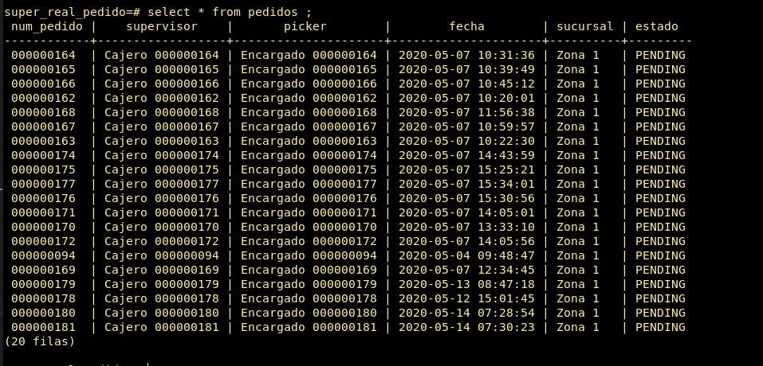

## superreal pedidos migrator

- Clonar el repositorio
- Instalar las dependencias
- Actualizar el archivo ./db.js con los datos de conexion a su base de datos

### Instrucciones

```sh
# para instalar las dependencias del proyecto 
$ npm install
# para ejecutar el proyecto
$ npm start
```

### Dependencias
- [pg](https://node-postgres.com/)
- [request](https://github.com/request/request)
- [cron](https://www.npmjs.com/package/cron)
- [pm2](https://www.npmjs.com/package/pm2)


### Resultados
